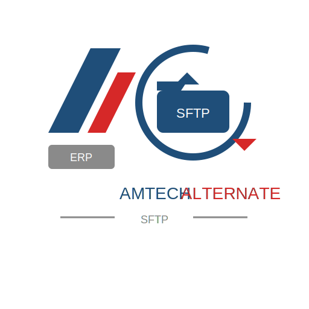

# Amtech Alternate SFTP

This bundle is a portable Amtech Alternate SFTP workflow.
It is designed to be easy to copy into a separate Git repository, review, and hand-edit
without touching any live production implementation.

Licensed under the MIT License.
See `DISCLAIMER.md` for the use-at-your-own-risk and backup-your-data notice.

## What It Does

- stages current `.dat` flat-file EDI documents from the configured source share
- sends them to the configured SFTP host and remote folder
- archives the originals to `Backup` as `.bak` files only after a successful send
- keeps the workflow intentionally narrow so it can serve as a temporary fallback

## File Types

- Send-ready files are `.dat` files in the configured source root.
- Historical/archive files are `.bak` files under the source root's `Backup` folder.
- `.cov` files are not used by this bundle as SFTP send inputs.

## Files

- `Launch-AmtechAlternateSftp.ps1`
- `Register-AmtechAlternateSftpTasks.ps1`
- `amtech_alternate_sftp.py`
- `SETUP.md`
- `USAGE.md`
- `SECURITY.md`
- `LICENSE`
- `DISCLAIMER.md`
- `requirements.txt`

## Quick Start

Read `SETUP.md` first, then use `USAGE.md` for day-to-day operation.

## Notes

- The source share path and SFTP target are editable in the launcher script.
- The scheduled task names and password-file path are editable in the task installer.
- This bundle is intentionally separate from any live production implementation.
- Review `SECURITY.md` before publishing logs, defaults, or deployment-specific copies.
- Read `DISCLAIMER.md` before using the bundle in a real environment.
